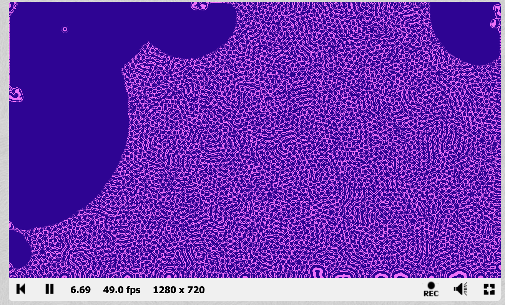

# Plastic Minds
### Continuous Neuroplastic Cellular Automaton · Real-Time GLSL Shader

[**View Live on Shadertoy →**](https://www.shadertoy.com/view/wXVBz3)

---

## Overview

Plastic Minds is a continuous cellular automaton inspired by SmoothLife, reframed as a model of neuroplasticity — the brain's capacity to reorganize itself through experience. Rather than binary on/off cell states, each cell holds a continuous activation value representing synaptic strength. Learning, stabilization, and forgetting emerge gradually over time as the system responds to interaction history and local network context.

The result is a self-organizing system that never converges to a fixed state. Its structure at any moment is a record of what has happened to it — an accumulated history of stimulation, rest, and decay.

---

## Why This Matters Beyond Visuals

This project sits at the intersection of two questions that are central to AI safety research:

**How do systems learn, and how do they forget?**

The dynamics modelled here — excitation, inhibition, gradual pruning, and pathway stabilization — are structurally analogous to the processes that govern how neural networks form representations, overfit, generalize, and degrade. Building and tuning this system required developing concrete intuitions about learning rates, temporal scale, feedback stability, and the difference between local pattern formation and global saturation.

**What does it mean for a system to have memory?**

The interaction history encoded in the synaptic state buffer is a form of implicit memory — the system's current behaviour depends on its past. This is directly relevant to questions in mechanistic interpretability about how transformer models encode information across layers, and how prior context shapes current output in ways that are not always transparent.

---

## System Behaviour

Each cell evaluates activity within two neighbourhoods — a local zone corresponding to immediate firing, and a broader zone representing wider network context. Synaptic strength increases, stabilizes, or decays smoothly based on these densities, producing:

- **Self-organizing pathways** — persistent structures emerge from local interaction rules
- **Gradual pruning** — low-activity regions decay over time
- **Experience-dependent organization** — structure reflects interaction history, not predetermined outcomes
- **Continuous plasticity** — the system never freezes; it remains responsive to new input

---

## Interaction

- **Mouse click and drag** — introduces localized stimulation, strengthening pathways through repeated interaction
- **Spacebar** — triggers a global weakening event simulating rest or cognitive reset

Because behaviour depends on both initial conditions and user input, no two runs produce identical structural outcomes.

---

## Technical Architecture

| Component | Role |
|-----------|------|
| **Feedback buffer** | Stores synaptic activation state across frames |
| **Smooth radial weighting** | Computes neighbourhood density without hard boundaries |
| **Sigmoid transitions** | Replaces binary thresholds to preserve continuous dynamics |
| **Developmental ramp** | Gradually introduces plasticity to prevent premature global organization |

### Key Design Challenge
Early versions exhibited rapid saturation — activity spread too quickly, erasing meaningful local structure. Resolving this required slowing the learning rate and introducing a temporal developmental ramp. This mirrors a real challenge in training neural networks: balancing learning speed against the preservation of structured, generalizable representations.

---

## Future Extensions

- Separate excitatory and inhibitory cell populations
- Synaptic fatigue and refractory periods
- Real-time parameter modulation during runtime
- Long-term memory layers encoding extended interaction history

---

## References

Gazerani, P. (2025). The neuroplastic brain: Current breakthroughs and emerging frontiers. *Brain Research, 1858*, 149643. https://doi.org/10.1016/j.brainres.2025.149643

Puderbaugh, M., & Emmady, P. D. (2023). Neuroplasticity. In *StatPearls*. StatPearls Publishing. https://www.ncbi.nlm.nih.gov/books/NBK557811/

---

## Stack
`GLSL` `Shadertoy` `Cellular Automata` `SmoothLife` `Neuroplasticity` `Continuous Dynamical Systems`

---

*Part of an ongoing series of real-time shader simulations exploring emergent behavior in complex adaptive systems.*
